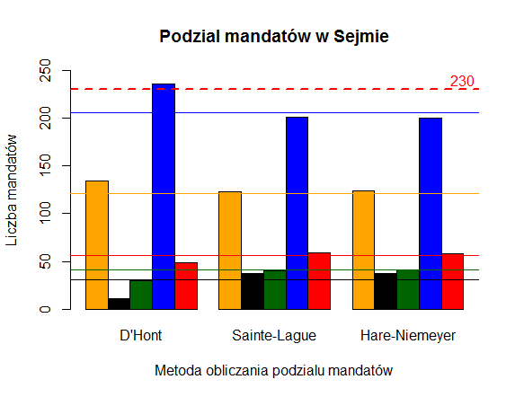

# Wybory
Ten zestaw funkcji pozwoli Ci na przeliczanie podziału mandatów w danych okręgach wyborczych do Sejmu RP.
Użyj funkcji `wybory`, wpisz poparcie dla 5 komitetów wyborczych oraz wybierz numer okręgu wyborczego, aby zobaczyć jak rozkładałyby się w takiej sytuacji mandaty pomiędzy komitetami w zależności od zastosowanej metody: **D'Honta** , **Sainte-Lague** lub **Hare-Niemeyera**. Jako siódmą zmienną możesz także ustalić frekwencję wyborczą - domyślnie ustawiona jest ona na 100%.
Funkcja zwraca wynik w formie macierzy w której każda kolumna zawiera liczbę mandatów uzyskanych przez komitet wg danej metody. Zobaczysz także wygenerowany wykres slupkowy.
Możesz użyć także funkcji `wybory_pl`, która symuluje rozkład mandatów w Sejmie różnymi metodami w hipotetycznym przypadku równomiernego rozkładu głosów na partie w każdym okręgu. Jako argumenty należy podać poparcie poszczególnych komitetów oraz ewentualnie frekwencję (domyślnie 100%). Funkcja nie uwzględnia jednak na ten moment ograniczenia w postaci 5-procentowego progu wyborczego dla komitetu - mandaty dostanie każda partia której one przysługują, niezależnie od wyniku ogólnopolskiego. Tutaj także rozklad mandatów zostanie przedstawiony dodatkowo w formie wykresów slupkowych.
Funkcja `wybory_rok` oblicza realny rozkład mandatów w Sejmie dla procentowych wyników wyborów z danego roku używając do tego wszystkich trzech wpspomnianych metod. Jej jedynym argumentem jest macierz klasy **macierz_wynikow**, którą można stworzyć przy użyciu konstruktora - `konstruktor_wynikow`. Potrzebujesz do niego danych z wynikami w formie pliku CSV możliwego do pobrania ze strony PKW. Oprócz nazwy pliku, należy podać numery kolumn, w których znajdują się interesujące nas dane nt. poparcia poszczególnych komitetów.

Dostępne są także funkcje składowe: `dhont`, `sainte_lague` oraz `hare_niemeyer`.

# Uwagi
Funkcja niestety nie zawsze radzi sobie w przypadku potrójnych remisów - sytuacji gdy trzy komitety osiągnęły dokładnie ten sam wynik. Z tego względu, celem uniknięcia błędów staraj się różnicować wyniki choćby o ułamki procentów. Zwykłe remisy są rozstrzygane poprawnie.