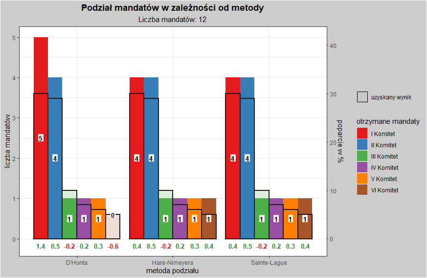
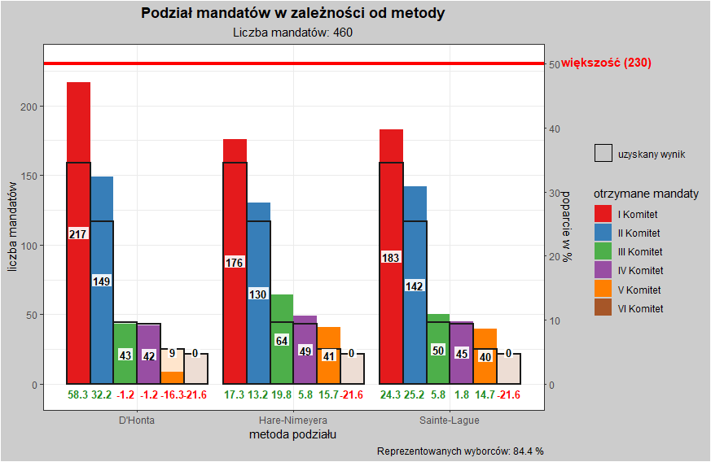
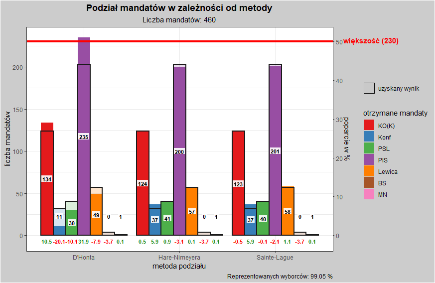
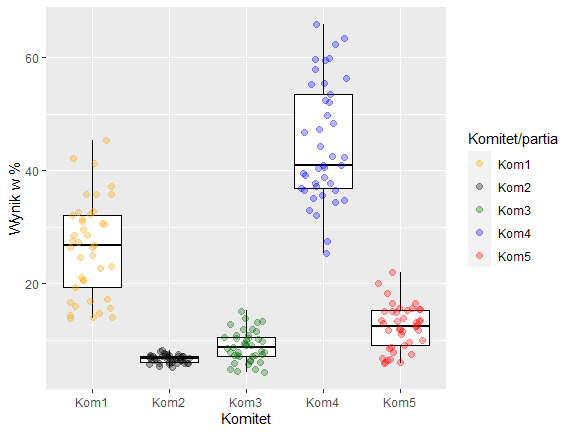

# Wstep
Ten zestaw funkcji pozwoli Ci na przeliczanie podziału mandatów w danych okręgach wyborczych do Sejmu RP trzema różnymi metodami: **D'Honta** , **Sainte-Lague** lub **Hare-Niemeyera**. Okreslajac wyniki procentowe dla poszczególnych komitetów lub korzystajac z prawdziwych wyników pobranych ze strony PKW możesz sprawdzić jak rozkladalyby sie mandaty na poziomie okregów lub calego kraju.

Przed rozpoczeciem korzystania z wlasciwych funkcji tego pakietu, **musisz pobrać** ze strony PKW aktualny plik CSV zawierajacy dane dotyczace okregów wyborczych w Polsce. Bez tych informacji (liczby mandatów oraz wyborców w okregu) inne funkcje nie beda dzialaly poprawnie.

Link do aktualnych (2019) danych o okregach wyborczych do Sejmu: [LINK](https://sejmsenat2019.pkw.gov.pl/sejmsenat2019/data/csv/okregi_sejm_csv.zip)

Nastepnie należy użyć funkcji `konstruktor_okregow` wpisujac nazwe pobranego i rozpakowanego pliku. Nie zwróci ona żadnego wyniku, wyswietli jedynie komunikat "Stworzono obiekt o nazwie 'okregi'".

```r
konstruktor_okregow("okregi_sejm.csv")
```

## Funkcja "wybory_okreg"
Użyj funkcji `wybory_okreg`, wpisz poparcie dla 5 komitetów wyborczych oraz wybierz numer okręgu wyborczego, aby zobaczyć jak rozkładałyby się w takiej sytuacji mandaty pomiędzy komitetami w zależności od zastosowanej metody podzialu mandatów. Jako siódmą zmienną możesz także ustalić frekwencję wyborczą - domyślnie ustawiona jest ona na 100%.
Funkcja zwraca wynik w formie macierzy w której każda kolumna zawiera liczbę mandatów uzyskanych przez komitet wg danej metody. Zobaczysz także wygenerowany wykres slupkowy. Poziome linie wyznaczaja realne poparcie komitetów w odniesieniu do liczby mandatów dostepnych w danym okregu wyborczym.

```r
wybory_okreg(kom1 = 30, kom2 = 29, kom3 = 10, kom4 = 7, kom5 = 6, okreg = 4)
```



## Funkcja "wybory_pl"
Możesz użyć także funkcji `wybory_pl`, która symuluje rozkład mandatów w Sejmie różnymi metodami w hipotetycznym przypadku równomiernego rozkładu głosów na partie w każdym okręgu. Jako argumenty należy podać poparcie poszczególnych komitetów oraz ewentualnie frekwencję (domyślnie 100%). Funkcja nie uwzględnia jednak na ten moment ograniczenia w postaci 5-procentowego progu wyborczego dla komitetu - mandaty dostanie każda partia której one przysługują, niezależnie od wyniku ogólnopolskiego. Tutaj także rozklad mandatów zostanie przedstawiony dodatkowo w formie wykresów slupkowych. Ciagle kolorowe linie wyznaczaja realne poparcie komitetów w przeliczeniu na mandaty poselskie, natomiast czerwona linia przerywana ilustruje próg 231 mandatów - tyle ile jest potrzebne do samodzielnych rzadów w parlamencie.

```r
wybory_pl(kom1 = 33, kom2 = 24, kom3 = 13, kom4 = 9, kom5 = 7)
```



## Funkcja "wybory_rok"
Funkcja `wybory_rok` oblicza realny rozkład mandatów w Sejmie dla procentowych wyników wyborów z danego roku używając do tego wszystkich trzech wspomnianych metod. Jej jedynym argumentem jest macierz klasy **macierz_wynikow**, którą można stworzyć przy użyciu konstruktora - `konstruktor_wynikow`. Potrzebujesz do niego danych z wynikami w formie pliku CSV możliwego do pobrania ze strony PKW. Oprócz nazwy pliku, należy podać numery kolumn, w których znajdują się interesujące nas dane nt. poparcia poszczególnych komitetów.
Funkcja `konstruktor_wynikow` zwraca obiekt o nazwie "okregi_wyniki".

**Przyklad:** 
1. Pobranie pliku CSV z wynikami wyborów parlamentarnych w 2019 roku - [LINK](https://sejmsenat2019.pkw.gov.pl/sejmsenat2019/data/csv/wyniki_gl_na_listy_po_okregach_sejm_csv.zip)
2. Rozpakowanie pliku .zip w wybranym folderze.
3. Przegladniecie pliku w programie obsugujacym arkusze kalkulacyjne; zidentyfikowanie w których kolumnach arkusza znajduja sie wyniki interesujacych nas komitetów.
4. Użycie poniższego kodu.

```r
wybory_2019 = konstruktor_wynikow("sejm_wyniki2019.csv", 9, 11, 12, 14, 16)
wybory_rok(wybory_2019)
```

Wygenerowany za pomoca funkcji `wybory_rok` wykres obrazujacy rozklad mandatow w Sejmie po wyborach parlamentarnych 2019 w zaleznosci od wybranej metody przeliczania. Czerwona przerywana linia oznacza liczbe mandatów potrzebnych do uzyskania wiekszosci w Sejmie, natomiast ciensze, kolorowe linie obrazuja realne poparcie danych komitetów w przeliczeniu na sejmowe mandaty:


## Funkcja "wykres_wyniki" - wykres eksploracyjny
Używajac funkcji `wykres_wyniki` o identycznych argumentach jak w funkcji `wybory_rok` możemy stworzyć wykres pudelkowy obrazujacy rozklad wyników poszczególnych komitetów wyborczych w okregach.

```r
wykres_wyniki("sejm_wyniki2019.csv", 9, 11, 12, 14, 16)
```



# Uwagi
- Funkcja niestety nie zawsze radzi sobie w przypadku potrójnych remisów - sytuacji gdy trzy komitety osiągnęły dokładnie ten sam wynik. Z tego względu, celem uniknięcia błędów staraj się różnicować wyniki choćby o ułamki procentów. Zwykłe remisy są rozstrzygane poprawnie.
- Dostępne są także funkcje składowe: `dhont`, `sainte_lague` oraz `hare_niemeyer`.
