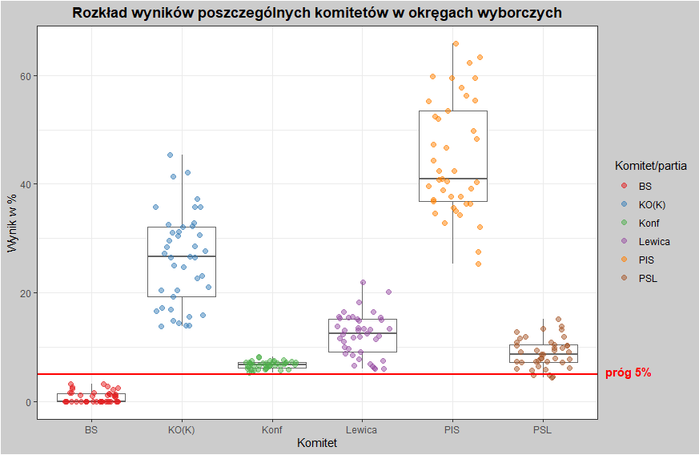
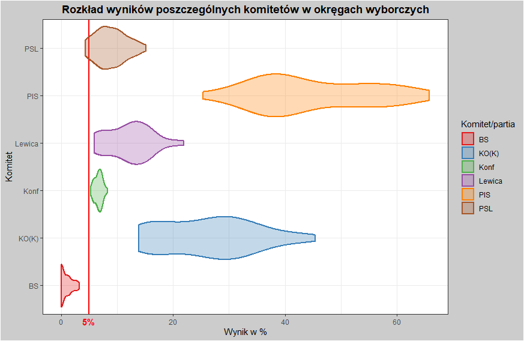
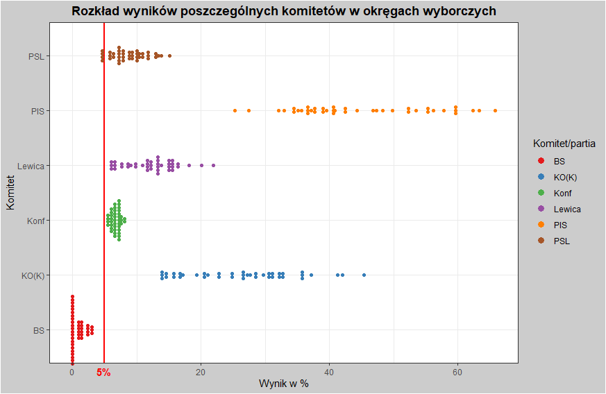
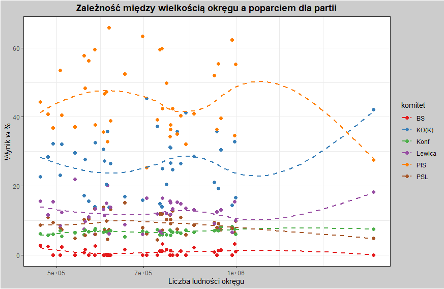

# Pakiet 'wybory'

## Spis treści
* [Instalacja](#Instalacja)
* [Wstęp i pobranie danych](#Wstęp-i-pobranie-danych)
* [Podział mandatów w wybranym okręgu](#Funkcja-wybory_okreg)
* [Podział mandatów w Sejmie przy równomiernym poparciu w skali kraju](#Funkcja-wybory_pl)
* [Podział mandatów w Sejmie na podstawie prawdziwych wyników wyborów](#Funkcja-wybory_rok)
* [Wykresy eksploracyjne](#Funkcja-wykres_wyniki---wykres-eksploracyjny)
* [Uwagi](#Uwagi)

## Instalacja
Aby pobrać ten pakiet, użyj poniższych poleceń aby połączyć się z repozytorium GitHub.

```r
remotes::install_github("TomekMatuszek/wybory")
library(wybory)
```

## Wstęp i pobranie danych
Ten pakiet funkcji pozwoli Ci na przeliczanie podziału mandatów w danych okręgach wyborczych do Sejmu RP trzema różnymi metodami: **D'Honta** , **Sainte-Lague** oraz **Hare-Niemeyera**. Określając wyniki procentowe dla poszczególnych komitetów lub korzystając z prawdziwych wyników pobranych ze strony PKW możesz sprawdzić jak rozkladałyby się mandaty na poziomie okregów lub całego kraju.

Przed rozpoczęciem korzystania z właściwych funkcji tego pakietu, należy **pobrać pliki** zawierające informacje o okręgach wyborczych oraz wyniki wyborów parlamentarnych w wybranym przez użytkownika roku (aktualnie dostępne są wyniki z lat 2007-2019). Aby tego dokonać, należy użyć funkcji `pobierz_wyniki` poprzez podanie jako argumentu wybranego roku, w którym odbyły się wybory do Sejmu. Opcjonalnym argumentem jest podanie ścieżki do folderu w którym mają zostać zapisane pobrane przez funkcję pliki. Domyślną wartością tego argumentu jest ścieżka aktualnie otwartego projektu RStudio.

```r
pobierz_wyniki(2019)
```

W wyniku działania tej funkcji powstanie folder **dane_wybory**, w którym znajdują się dwa pliki w formie arkuszów kalkulacyjnych: jeden zawierający dane o okręgach wyborczych (liczba wyborców i mandatów) oraz drugi, w którym znajdują się wyniki poszczególnych komitetów w wyborach. Funkcja stworzy również od razu na podstawie pliku 'okregi[rok].xlsx' obiekt `okregi` potrzebny w funkcjach obliczających rozkład mandatów - dzięki temu użytkownik nie musi zaglądać do wyżej wspomnianego pliku.

Jeśli jednak użytkownika nie interesują historyczne wyniki wyborów i chce on używać jedynie funkcji zajmujących się sztucznie stworzonymi wynikami, może on samemu pobrać jedynie plik z danymi o okręgach ze strony PKW [Link do danych na rok 2019](https://sejmsenat2019.pkw.gov.pl/sejmsenat2019/data/csv/okregi_sejm_csv.zip)

Następnie należy użyć funkcji `konstruktor_okregow` wpisujac ścieżkę do pobranego i rozpakowanego pliku. Nie zwróci ona żadnego wyniku, wyświetli jedynie komunikat "Stworzono obiekt o nazwie 'okregi'". **UWAGA!** W powyższej sytuacji należy ręcznie zmienić nazwę pliku na 'okregi2019.csv'!

```r
konstruktor_okregow("okregi2019.csv")
```

## Podział mandatów w wybranym okręgu
Użyj funkcji `wybory_okreg`, wpisz poparcie dla dowolnej ilości komitetów wyborczych (max. 10) oraz wprowadź numer okręgu wyborczego, aby uzyskać ramkę danych z podziałem mandatów pomiędzy komitetami w zależności od zastosowanej metody. Jako ostatnią zmienną możesz także ustalić frekwencję wyborczą - domyślnie ustawiona jest ona na 100%.
Tak stworzoną ramkę danych możesz podać jako argument funkcji `wykres_mandaty`, która wyświetli wykres słupkowy przedstawiający rozkład mandatów w Sejmie dla każdej metody podziału, a także porówna liczbę zdobytych przez każdy komitet mandatów z liczbą jaką zusykałby gdyby dzielić miejsca w okręgu czysto proporcjonalnie.

```r
wyniki4 = wybory_okreg(30, 29, 10, 7, 6, okreg = 4, frekwencja = 100)
wykres_mandaty(wyniki4)
```


## Podział mandatów w Sejmie przy równomiernym poparciu w skali kraju
Możesz użyć także funkcji `wybory_pl`, która symuluje rozkład mandatów w Sejmie różnymi metodami w hipotetycznym przypadku równomiernego rozkładu głosów na partie w każdym okręgu. Jako argumenty należy podać poparcie poszczególnych komitetów oraz ewentualnie frekwencję (domyślnie 100%). Wynikiem działania funkcji będzie ramka danych z podziałem mandatów dla wszystkich trzech metod.
Uzyskane wyniki również można użyć w funkcji `wykres_mandaty`, aby stworzyć wykres przedstawiający rozkład mandatów w Sejmie oraz, dla kontrastu, proporcjonalny podział mandatów.

```r
wyniki_pl = wybory_pl(34.5, 25.4, 9.6, 9.4, 5.5, 4.7, koalicje = c(2))
wykres_mandaty(wyniki_pl)
```


## Podział mandatów w Sejmie na podstawie prawdziwych wyników wyborów
Funkcja `wybory_rok` oblicza realny rozkład mandatów w Sejmie dla wyników wyborów z danego roku używając do tego wszystkich trzech wspomnianych metod. Jej jedynym argumentem jest ramka danych, którą można stworzyć przy użyciu konstruktora - `konstruktor_wynikow`. Potrzebujesz do niego danych pobranych przy pomocy funkcji `pobierz_wyniki`, a konkretnie - pliku **wyniki[rok].xlsx**. Oprócz ścieżki do pliku, należy podać numery kolumn (w formie wektora), w których znajdują się interesujące nas dane nt. poparcia poszczególnych komitetów.
Tak samo jak w przypadku funkcji `wybory_pl` - wyniki działania tej funkcji można przedstawić w formie wykresu słupkowego tworzonego przy pomocy funkcji `wykres_mandaty`.

**Przyklad:** 

```r
pobierz_wyniki(2019)
wybory_2019 = konstruktor_wynikow("dane_wybory/wyniki2019.xlsx",
                                  c("KO" = 9, "Konf" = 11, "PSL" = 12, "PIS" = 14,
                                    "Lewica" = 16, "BS" = 17, "MN" = 18))
wybory_rok(wybory_2019)
wykres_mandaty(wyniki_2019)
```

Wygenerowany za pomoca funkcji `wykres_mandaty` wykres obrazuje rozkład mandatów w Sejmie po wyborach parlamentarnych w wybranym roku, w zależności od wybranej metody przeliczania. Czerwona linia oznacza liczbę mandatów potrzebnych do uzyskania wiekszosci w Sejmie. Przedstawiony jest także rozkład mandatów w Sejmie dla każdej metody podziału, a także porówna liczbę zdobytych przez każdy komitet mandatów z liczbą jaką zusykałby gdyby dzielić miejsca w okręgu czysto proporcjonalnie.


## Wykresy eksploracyjne
Używając funkcji `wykres_wyniki` możemy stworzyć wykresy wizualizujące wyniki wyborów w podziale na okręgi wyborcze. Dostępne typy wykresów to:
- **boxplot** - rozkład wyników w okręgach dla każdego komitetu
- **violin** - inna wersja poprzedniego wykresu
- **dotplot** - inna wersja powyższych wykresów
- **scatter** - zależność między wynikiem każdego komitetu a liczbą ludności w okręgach wyborczych

```r
wykres_wyniki(wybory_2019, type = "boxplot")
wykres_wyniki(wybory_2019, type = "violin")
wykres_wyniki(wybory_2019, type = "dotplot")
wykres_wyniki(wybory_2019, type = "scatter")
```









# Uwagi
- Funkcja niestety nie zawsze radzi sobie w przypadku potrójnych remisów - sytuacji gdy trzy komitety osiągnęły dokładnie ten sam wynik. Z tego względu, celem uniknięcia błędów staraj się różnicować wyniki choćby o ułamki procentów. Zwykłe remisy są rozstrzygane poprawnie.
- Dostępne są także funkcje składowe: `dhont`, `sainte_lague` oraz `hare_niemeyer`.
